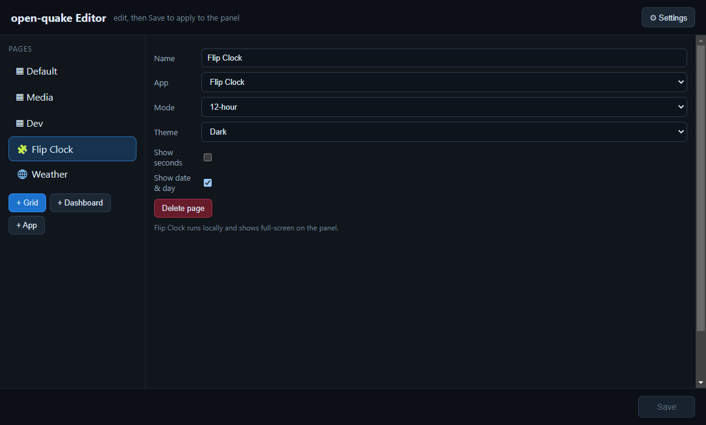

# Bundled apps

Bundled local web apps live in `apps/`, listed in `apps/apps.json` (each with a
name, file, and an options schema). In the editor, **+ App** adds an app page:
pick the app and set its options — open-quake loads it full-screen on the panel,
no server and no hand-typed URLs.

Included apps:
- **Flip Clock** — split-flap animation, 12/24-hour, optional seconds, and a corner
  date/day. (12-hour shows a single hour card with an AM/PM badge; 24-hour shows two hour
  cards.) Follows the global light/dark theme and accent. Ships **enabled by default** (12-hour).
- **World Clock** — the time in several places at once. Two modes: **US time zones**
  (Pacific / Mountain / Central / Eastern) or a pick of **2–6 world cities**; each shown as a
  **digital** readout or an **analog** face. Options include 12/24-hour, optional seconds (with
  a second hand on the analog faces), and a **per-city label override** (e.g. pick *London* but
  label it *Edinburgh*). DST-correct via the system's time-zone database; follows the global
  light/dark theme and accent.
- **[Music controller](music.md)** — now-playing + transport + a programmable app grid.
- **[Open WebUI chat + voice](ai-chat.md)** — talk to your own LLM, with knob push-to-talk.

## Write your own

Two kinds of bundled app:

- **Static (`file://`)** — drop an HTML file in `apps/` that reads its settings from the URL
  **hash** (e.g. `…/myapp.html#color=red`) — a `?query` doesn't survive a `file://`
  load — and add an entry to `apps/apps.json` describing its options. The Flip Clock is one.
- **Served (`"served": true`)** — for apps that need live host data, a same-origin `fetch`,
  or an embedded launcher grid. open-quake serves these over a loopback HTTP server at
  `http://127.0.0.1:<port>/<id>`, so they get real `?query` params and a secure context
  (needed for things like the microphone). The Music controller and Open WebUI app use this.
  A served app can also carry its own **editable tile grid** (`"grid"` in its manifest entry) —
  the "grid embedded in an app" capability.
