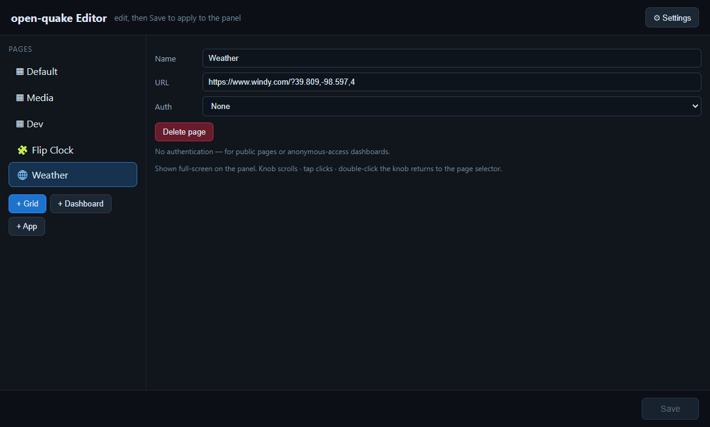

# Web dashboards

A page can be a web view instead of a tile grid (**+ Dashboard** in the editor —
give it a name + URL). It renders full-screen on the panel; the knob scrolls it
(inner scroll panels included), a tap is a click, and double-clicking the knob
returns to the page selector. Sessions persist across restarts. open-quake ships
with a public **[Windy](https://www.windy.com) weather map** as a ready-made
dashboard example.

**Auth** is set per page in the editor — needed because the panel has no keyboard:

| Type | For |
|---|---|
| **None** | public / anonymous pages (Flipboard, anonymous Grafana) |
| **Home Assistant token** | HA — paste a Long-Lived Access Token; the panel seeds it and loads signed-in |
| **HTTP Basic Auth** | sites behind a real `401` / `WWW-Authenticate: Basic` challenge (e.g. nginx `auth_basic`) |
| **Custom header(s)** | bearer tokens, Grafana service accounts, Cloudflare Access (`CF-Access-Client-Id` / `-Secret`) |

**Form-login apps** — which redirect to a `/login` *page* instead of issuing a
`401` — aren't covered by Basic Auth. Either have the app accept a **bearer token**
and use Custom header, or, since the panel runs on your PC, click the login form
with your PC mouse/keyboard once: the persistent session keeps you signed in.

## Adding a dashboard

Web **Dashboard** pages are added the same way as grids and apps — **+ Dashboard**
in the editor, then set the page's name, URL, and (if the site needs it) auth — see
the auth options above. Use **Delete page** to remove one.

